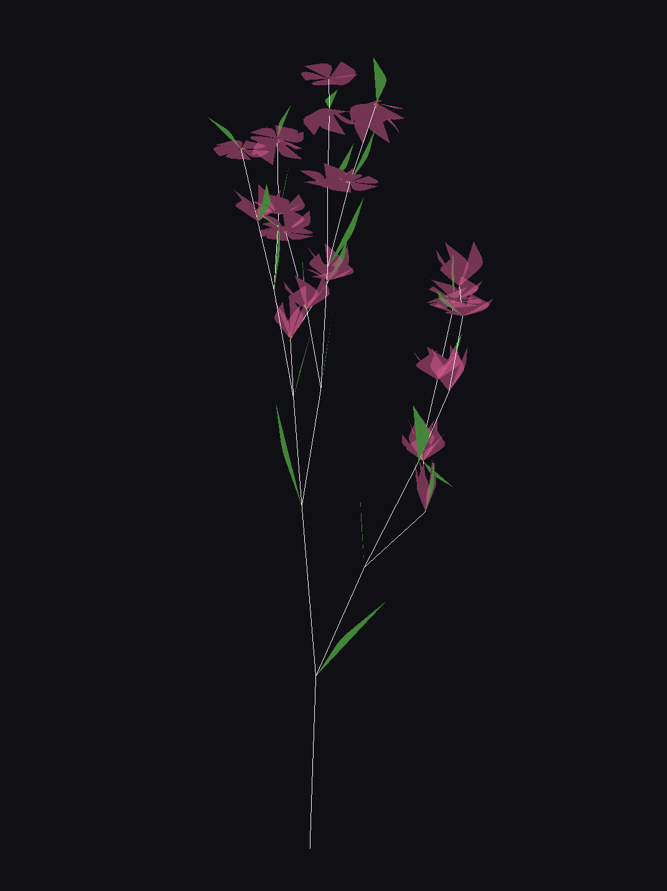
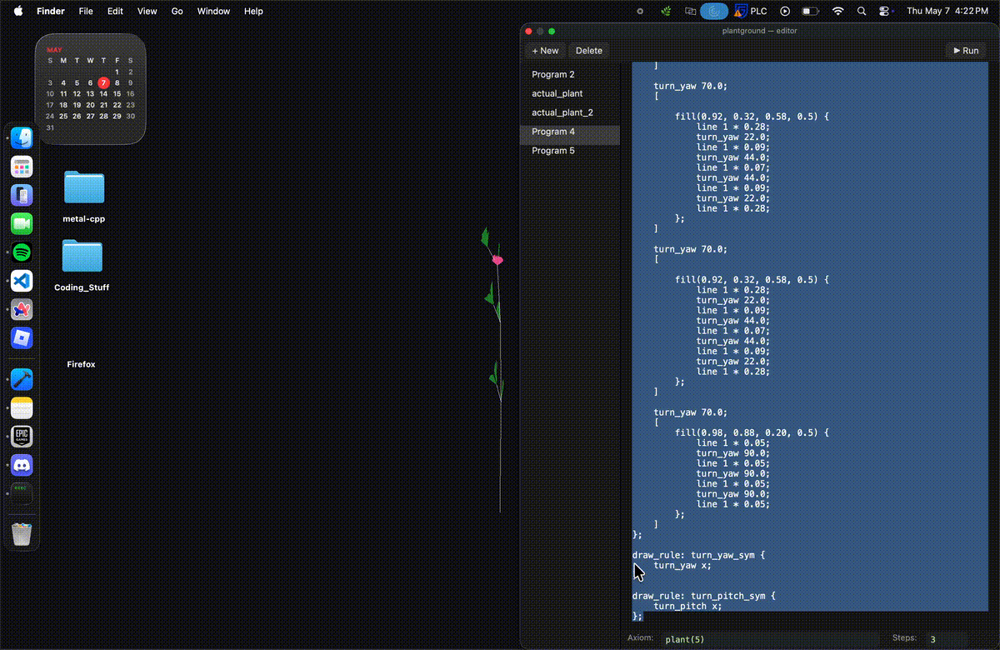

# L-System Compiler

A custom C-like domain-specific language (DSL) and GPU-accelerated rendering engine for procedural L-system generation using C++ and Metal.

---



## Video example

<p align="center">
  
</p>
## Features

- Custom C-like DSL for procedural plant generation
- Parametric L-system rules
- User-defined procedures and expressions
- GPU-accelerated rendering using Metal
- Real-time procedural geometry generation
- Supports stochastic behaviour (L-Sys generation)

---

## Architecture

```text
Source Code
    ↓
Lexer
    ↓
Parser
    ↓
AST Generation
    ↓
Rule Evaluation
    ↓
L-System Expansion
    ↓
Geometry Generation
    ↓
Metal Renderer
```

---

## Program Structure

L-sys C requires a strict declaration order.

```c
global float x = 1.0;

symbol F(float x);
symbol G(float x);

rule: F(float x) -> ...;

draw_rule: F {
    ...
};

float fn(float v) {
    return v * 2.0;
}
```

Order:
1. Global variables
2. Symbol declarations
3. Rules
4. Draw rules
5. Procedures

---

## Global Variables

```c
global float angle = 27.5;
global float r     = 0.68;
global float minx  = 0.5;
```

Rules:
- All global variables are `float`
- `global` keyword is required
- Globals are visible inside:
  - rules
  - draw rules
  - procedures

---

## Symbol Declarations

Every symbol used in rules or the axiom must be declared.

```c
symbol F(float x);
symbol Branch(float len, float w);
symbol Leaf(float x);
```

Rules:
- All parameters are `float`
- Trailing semicolon required

---

## Rules

Rules define symbol rewriting behavior.

```c
rule: F(float x) when x > 0.5 ->
    F(x * r)
    [F(x * 0.55)]
    F(x * r);

rule: F(float x) -> F(x);
```

Features:
- Recursive rewriting
- Conditional rules
- Parametric symbols
- Arithmetic expressions
- Branching structures

---

## Draw Rules

Draw rules define how symbols are rendered.

```c
draw_rule: F {
    turn_yaw angle;
    line x;
};
```

Filled geometry is also supported:

```c
draw_rule: L {
    fill(0.14, 0.55, 0.18, 0.9) {
        line x * 0.50;
        turn_yaw 55.0;
        line x * 0.28;
        turn_yaw 70.0;
        line x * 0.30;
        turn_yaw 55.0;
        line x * 0.50;
    };
};
```

---

## Procedures

Procedures allow reusable computations.
Procedures must first define any local variables, then statements then have a return statement.
This structure is because writing a compiler is hard.
```c
float shrink(float v) {
    return v * 0.7;
}
```

Example with conditionals:

```c
float clamp(float v, float mn) {
    if (v < mn) {
        v = mn;
    } else {
        v = v;
    }

    return v;
}
```

Rules:
- Procedures must come after all rules
- No semicolon after closing brace
- Local variables use `float`
- Procedures can mutate global variables (more on this in the future)

---

## Expressions

Supported operations:
- Addition +
- Subtraction -
- Multiplication *
- Division /
- Modulo %

Example:

```c
x * 0.8 + angle
```

---

## Branching

Branching uses bracket notation.

```c
[
    plant(x * 0.7)
]
```

Behavior:
- `[` pushes turtle state
- `]` restores turtle state

---

## Example Program

```c
global float angle = 27.5;
global float r = 0.68;

symbol F(float x);

rule: F(float x) when x > 0.5 ->
    F(x * r)
    [F(x * 0.55)]
    F(x * r);

rule: F(float x) -> F(x);

draw_rule: F {
    turn_yaw angle;
    line x;
};
```

---

## Complex Example

```c
global float angle   = 22.0;
global float pitch   = 18.0;
global float r       = 0.65;
global float scale   = 8.0;

symbol plant(float x);
symbol internode(float x);
symbol leaf(float x);
symbol flower(float x);
symbol pedicel(float x);
symbol turn_yaw_sym(float x);
symbol turn_pitch_sym(float x);

rule: plant(float x) ->
    internode(x)
    turn_yaw_sym(angle)
    [
        turn_pitch_sym(angle * 0.9)
        plant(x * 0.7)
        flower(x * 0.35)
    ]
    turn_yaw_sym(-1 * angle * 2.0)
    [
        turn_pitch_sym(-1 * angle * 0.5)
        leaf(x * 0.4)
    ]
	turn_yaw_sym(260 * rand() - 100)
    internode(x)
    [
        turn_yaw_sym(angle * 2.2)
        turn_pitch_sym(angle * 0.6)
        leaf(x * 0.4)
    ]
    turn_yaw_sym(-1 * angle)
    [
        turn_pitch_sym(-1 * angle * 0.8)
        plant(x * 0.7)
        flower(x * 0.35)
    ]
    turn_yaw_sym(angle * 2.0)
    plant(x * r);

rule: flower(float x) ->
    pedicel(x * 0.5)
    flower(x);

rule: pedicel(float x) ->
    internode(x);

draw_rule: internode {
    turn_yaw angle * 0.25;
    turn_pitch pitch * 0.15;
    line x * 0.5;
};

draw_rule: leaf {
    turn_yaw (rand() - 0.5) * 180.0;
    turn_pitch (rand() - 0.5) * 120.0;
    turn_roll (rand() - 0.5) * 180.0;

    fill(0.14, 0.55, 0.18, 0.95) {
        line x * 0.32;
        turn_yaw 10.0;
        line x * 0.07;
        turn_yaw 20.0;
        line x * 0.05;
        turn_yaw 20.0;
        line x * 0.07;
        turn_yaw 10.0;
        line x * 0.32;
    };
};

draw_rule: pedicel {
    turn_pitch pitch * 0.25;
	[
	fill(0.80, 0.80, 0.00, 0.8) {
	line 1.45;
	};
	]
};

draw_rule: flower {
    turn_pitch -90.0;

    turn_yaw 70.0;
    [

        fill(0.92, 0.32, 0.58, 0.5) {
            line 1 * 0.28;
            turn_yaw 22.0;
            line 1 * 0.09;
            turn_yaw 44.0;
            line 1 * 0.07;
            turn_yaw 44.0;
            line 1 * 0.09;
            turn_yaw 22.0;
            line 1 * 0.28;
        };
    ]

    turn_yaw 70.0;
    [

        fill(0.92, 0.32, 0.58, 0.5) {
            line 1 * 0.28;
            turn_yaw 22.0;
            line 1 * 0.09;
            turn_yaw 44.0;
            line 1 * 0.07;
            turn_yaw 44.0;
            line 1 * 0.09;
            turn_yaw 22.0;
            line 1 * 0.28;
        };
    ]

    turn_yaw 70.0;
    [

        fill(0.92, 0.32, 0.58, 0.5) {
            line 1 * 0.28;
            turn_yaw 22.0;
            line 1 * 0.09;
            turn_yaw 44.0;
            line 1 * 0.07;
            turn_yaw 44.0;
            line 1 * 0.09;
            turn_yaw 22.0;
            line 1 * 0.28;
        };
    ]

    turn_yaw 70.0;
    [

        fill(0.92, 0.32, 0.58, 0.5) {
            line 1 * 0.28;
            turn_yaw 22.0;
            line 1 * 0.09;
            turn_yaw 44.0;
            line 1 * 0.07;
            turn_yaw 44.0;
            line 1 * 0.09;
            turn_yaw 22.0;
            line 1 * 0.28;
        };
    ]

    turn_yaw 70.0;
    [

        fill(0.92, 0.32, 0.58, 0.5) {
            line 1 * 0.28;
            turn_yaw 22.0;
            line 1 * 0.09;
            turn_yaw 44.0;
            line 1 * 0.07;
            turn_yaw 44.0;
            line 1 * 0.09;
            turn_yaw 22.0;
            line 1 * 0.28;
        };
    ]

    turn_yaw 70.0;
    [
        fill(0.98, 0.88, 0.20, 0.5) {
            line 1 * 0.05;
            turn_yaw 90.0;
            line 1 * 0.05;
            turn_yaw 90.0;
            line 1 * 0.05;
            turn_yaw 90.0;
            line 1 * 0.05;
        };
    ]
};

draw_rule: turn_yaw_sym {
    turn_yaw x;
};

draw_rule: turn_pitch_sym {
    turn_pitch x;
};
```

---


## Tech Stack

- C++
- Metal
- Objective-C++

---

To run, copy this directory and open the xcode. Must run on a MacOS machine with an M series chip.